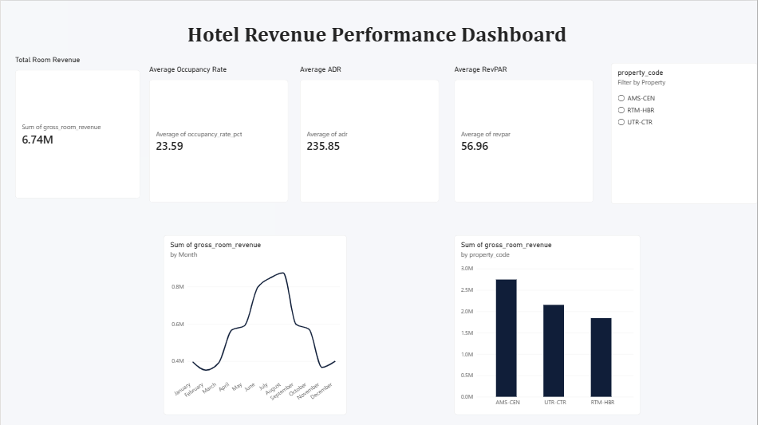

# Hotel Revenue Analytics

A PostgreSQL analytics engineering project that models hotel operations and
transforms booking and payment events into reliable revenue, occupancy,
cancellation, and guest-behaviour insights.

## Project status

Complete — PostgreSQL analytics model, quality checks, business analysis, and Power BI executive dashboard delivered.

## Dashboard

The Power BI report provides an executive view of total room revenue, occupancy,
ADR, RevPAR, monthly seasonality, and property-level performance.



## Business questions

- Which properties, room types, and channels drive revenue?
- What are the cancellation rate and booking lead-time patterns?
- How do occupancy, ADR, and RevPAR change over time?
- Which guests return, and what is their lifetime value?
- Where do payment and booking data-quality issues occur?

## Architecture

```text
raw       → source-style landing data
core      → validated operational entities and business rules
analytics → reporting-ready models and KPI views
audit     → status history and data-quality controls
```

## Technology

- PostgreSQL 18 and pgAdmin 4
- Power BI Desktop
- SQL, Git, and GitHub

## Selected findings

- Demand peaks in June–August and softens during autumn and winter.
- The executive snapshot contains 16,848 bookings, 11,124 completed stays, and a 21% cancellation rate.
- Amsterdam generates the highest room revenue, followed by Utrecht and Rotterdam.
- One-time guests account for roughly 47% of the customer base; loyal guests generate most lifetime room revenue.

## How to run

1. Run `database/migrations/001_foundation.sql` in a new PostgreSQL database.
2. Run `database/migrations/003_analytics_foundation.sql`.
3. Run `database/seeds/002_synthetic_operational_data.sql`, then `database/seeds/003_refresh_realistic_demand.sql`.
4. Run the scripts in `database/tests/` and `sql/analysis/`.

All seed data is synthetic and intended only for portfolio analysis.
